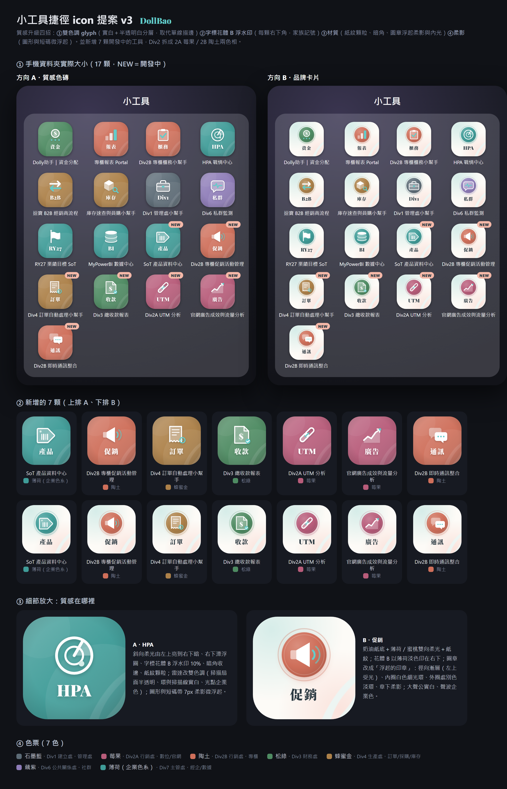

# DollBao 小工具 icon 系統

逗寶內部 GAS Web App（小工具）的手機捷徑／瀏覽器分頁 icon。所有工具共用同一套視覺語言，新工具上線時照下方三步加入即可。

## 視覺規則（方向 A「質感色磚」）

- **底色＝處別**：Div1 石墨藍 `#5C6B76`／Div2A 莓果 `#B85C7A`／Div2B 陶土 `#CF6F5A`／Div3 松綠 `#4E8B62`／Div4 蜂蜜金 `#AD8149`／Div6 藕紫 `#8E7CB8`／Div7 薄荷 `#3F9C98`（企業色系）。色值由官網改版 design token 加深而來。
- **白色雙色調圖形＝用途**（實白＋半透明白分層），**襯線短碼＝名字**（拉丁 Playfair Display Black、中文 Noto Serif TC Black，最多 4 字母或 2 中文字）。
- **企業色 `#63ccca`（A0017 螢幕色）只做點綴**（靶心、光點、打勾），不配白字。
- **家族記號**：右下角字標花體 B 浮水印 10%、斜向柔光、漂浮圓、暗角、紙紋。
- 512×512 滿版不做圓角（圓角交給手機桌面遮罩）；圖形與短碼收在中央 66% 圓內。

## 新工具三步

1. 在 `src/gen3.js` 的 `TOOLS` 加一列 `{ id, title, div, glyph, label, status }`。需要新圖形就在 `GLYPH` 補一個（以 (0,0) 為中心、±100 座標、用 `S/T/O/A/ac` 五種筆刷）。
2. 產圖：`node src/gen3.js && node src/renderA.js`（Node 18+、全域 playwright，會連 Google Fonts），把 `png3_A/<id>.png` 放進 `png/`，commit 推上 main。
3. GAS `doGet` 回傳的 HtmlOutput 加 `.setFaviconUrl(TOOL_FAVICON_URL)`，檔頂宣告 `var TOOL_FAVICON_URL = 'https://raw.githubusercontent.com/ark0720/dollbao-tool-icons/main/png/<id>.png';`，推新版本到**既有 deployment**（網址不變）。手機端刪舊捷徑、重新「加到主畫面」。

## 對照表

| id | 工具 | 處別 | 短碼 |
|---|---|---|---|
| dolly-funds | Dolly助手｜資金分配（外部系統） | Div3 | 資金 |
| counter-portal | 專櫃報表 Portal | Div2B | 報表 |
| counter-ops | Div2B 專櫃櫃務小幫手 | Div2B | 櫃務 |
| hpa-warroom | HPA 戰情中心 | Div7 | HPA |
| b2b-dealer | 逗寶 B2B 經銷商流程 | Div4 | B2B |
| inventory | 庫存速查與員購小幫手 | Div4 | 庫存 |
| inventory-report | Div4 庫存報表小幫手 | Div4 | 庫報 |
| div1-helper | Div1 管理處小幫手 | Div1 | Div1 |
| div6-monitor | Div6 私群監測 | Div6 | 私群 |
| ry27-target | RY27 業績目標 SoT | Div7 | RY27 |
| bi-datacenter | MyPowerBI 數據中心 | Div7 | BI |
| budget-check | Div3 每月預算核對小幫手 | Div3 | 預算 |
| budget-variance | Div3 各部門預算差異小幫手 | Div3 | 差異 |
| product-sot | SoT 產品資料中心（開發中） | Div7 | 產品 |
| counter-promo | Div2B 專櫃促銷活動管理（開發中） | Div2B | 促銷 |
| order-auto | Div4 訂單自動處理小幫手（開發中） | Div4 | 訂單 |
| receipts | Div3 總收款報表（開發中） | Div3 | 收款 |
| utm | Div2A UTM 分析（開發中） | Div2A | UTM |
| ads-traffic | 官網廣告成效與流量分析（開發中） | Div2A | 廣告 |
| im-hub | Div2B 即時通訊整合（開發中） | Div2B | 通訊 |

